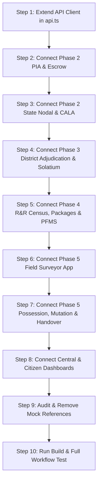

# NLAMS Frontend ↔ Backend Integration Guide

## 1. Objective

The goal of this initiative is to make the existing NLAMS (National Land Acquisition & Management System) React frontend **fully backend-driven**.

The FastAPI backend and its underlying database must become the **single source of truth** for all operational state, workflows, identity, calculations, and compliance verification.

### Target Architecture Flow
```
React UI (Components & Pages)
  │
  ▼
Frontend API Service Client (`frontend/src/services/api.ts`)
  │
  ▼
FastAPI Routers (`backend/app/api/*`)
  │
  ▼
Backend Business Service Layer (`backend/app/services/*`)
  │
  ▼
PostgreSQL / SQLite Database via SQLAlchemy ORM
```

> **Strict Invariant**: The UI layout, Tailwind design system, visual components, and UX workflows must **NOT** be redesigned. All existing component trees, modals, sidebars, charts, and styling must be preserved exactly as created.

---

## 2. Critical Rules & Guardrails

1. **No UI Redesign**: Do not rewrite, restructure, or restyle existing frontend UI components or Tailwind classes.
2. **Preserve Teammate Work**: Do not delete or overwrite components built by other team members.
3. **No Fake / In-Memory Mocking in Production**: Do not invent fake frontend responses or simulate backend transitions in client memory.
4. **No Production Mock Data Imports**: `mockData.ts`, `mockPiaData.ts`, `mockDistrictData.ts`, etc., must not be used as the source of truth in production builds.
5. **Backend Is Authoritative**: Do not replicate state machine transition rules, solatium multipliers, or statutory award logic in React. The backend workflow engine is authoritative.
6. **Preserve JWT Flow**: Reuse the existing `localStorage` token storage, Bearer header injection, and refresh token rotation in `src/services/api.ts`.
7. **Strict RBAC**: Never bypass backend 403 Forbidden errors with client-side overrides. Display standard permission error messages.
8. **Handle All HTTP States**: Every data-driven screen must handle:
   - **Loading**: Skeletons or spinners while awaiting promises.
   - **Empty**: Contextual empty-state messages when backend returns `[]` or `null`.
   - **Error**: Explicit user feedback for `400`, `401`, `403`, `404`, `422`, and `500` status codes.
9. **No Silent Fallbacks to Mock Data**: If an API call fails or encounters network timeout, do **not** silently load mock data. Display an explicit error state to the user.
10. **Report API Mismatches**: If an API endpoint is missing or returns an unexpected shape, document and coordinate with the backend team instead of creating temporary frontend mocks.

---

## 3. Current Integration Status

| Screen / Page | Current Data Source | Current Status | Backend Endpoint | Frontend Work Required |
|---|---|---|---|---|
| **[LoginPage.tsx](file:///c:/Users/soham/NLAMS/frontend/src/pages/LoginPage.tsx)** | `authApi` in `api.ts` | **YES (Fully Connected)** | `POST /auth/official/verify-otp`<br>`POST /auth/citizen/verify-otp`<br>`GET /auth/me` | None. Re-use current authentication and session token storage. |
| **[CentralDashboard.tsx](file:///c:/Users/soham/NLAMS/frontend/src/pages/CentralDashboard.tsx)** | `src/data/mockCentralData.ts` | **NO (Completely Mock)** | `GET /proposals/analytics/national-summary` *(To be added)* | Connect national KPI counters, state performance table, SLA alert list, and map aggregates. |
| **[StateNodalDashboard.tsx](file:///c:/Users/soham/NLAMS/frontend/src/pages/StateNodalDashboard.tsx)** | `src/data/mockStateNodalData.ts` | **NO (Completely Mock)** | `GET /proposals/`<br>`POST /proposals/{id}/state-scrutiny`<br>`POST /state-gateway/assign-cala`<br>`GET /state-gateway/land-registry/{state}/survey/{no}`<br>`POST /state-gateway/multipliers` | Fetch live proposals; wire scrutiny approve/reject; wire CALA appointment modal; connect RoR lookup and multiplier matrix updates. |
| **[PiaDashboard.tsx](file:///c:/Users/soham/NLAMS/frontend/src/pages/PiaDashboard.tsx)** | `src/data/mockPiaData.ts` | **NO (Completely Mock)** | `GET /proposals/`<br>`POST /proposals/`<br>`POST /proposals/{id}/dpr`<br>`POST /proposals/{id}/kml`<br>`GET /escrow/proposal/{id}`<br>`POST /escrow/{acc}/deposit`<br>`POST /possession/pia-handover-action` | Bind project list to live proposals; wire modal proposal intake; bind DPR/KML file uploaders; wire escrow deposit form; wire PIA handover acceptance gate. |
| **[DistrictDashboard.tsx](file:///c:/Users/soham/NLAMS/frontend/src/pages/DistrictDashboard.tsx)** | `src/data/mockDistrictData.ts` | **NO (Completely Mock)** | `POST /adjudication/section11-notification`<br>`POST /adjudication/section11/{id}/publish`<br>`POST /adjudication/parcels/freeze-interim`<br>`GET /adjudication/objections/proposal/{id}`<br>`POST /adjudication/objections/{id}/hearing`<br>`POST /adjudication/objections/{id}/ruling`<br>`POST /adjudication/valuation/calculate-statutory-solatium`<br>`POST /adjudication/awards/pronounce-section23-award`<br>`POST /rnr/payments/disburse-compensation`<br>`GET /possession/readiness/{id}`<br>`POST /possession/create-panchnama`<br>`POST /possession/issue-certificate`<br>`POST /possession/execute-digital-mutation` | Connect Section 11 notice issuance & publication; connect parcel freeze toggle; bind objection hearing records; wire statutory valuation calculator; trigger award pronouncement; execute PFMS compensation disbursal; wire Panchnama & certificate generation; trigger digital mutation. |
| **[RnRAdminDashboard.tsx](file:///c:/Users/soham/NLAMS/frontend/src/pages/RnRAdminDashboard.tsx)** | `src/data/mockRnrData.ts` | **NO (Completely Mock)** | `GET /rnr/census/proposal/{id}`<br>`POST /rnr/census/families`<br>`POST /rnr/entitlements/generate-packages`<br>`POST /rnr/entitlements/{id}/approve`<br>`GET /rnr/community-assets/proposal/{id}`<br>`POST /rnr/community-assets`<br>`POST /rnr/payments/disburse-rnr` | Connect PAF census registration & family listing; trigger automated Schedule II entitlement packages; submit package approvals; wire community asset tracking; trigger R&R financial benefits disbursal. |
| **[FieldSurveyorApp.tsx](file:///c:/Users/soham/NLAMS/frontend/src/pages/FieldSurveyorApp.tsx)** | `src/data/mockSurveyorData.ts` | **PARTIAL (UI Ready, Mock Data)** | `GET /surveyor/tasks`<br>`POST /surveyor/boundary-walk`<br>`POST /surveyor/asset-evidence`<br>`POST /surveyor/batch-sync`<br>`POST /surveyor/verify` | Fetch assigned field tasks; submit GPS walk polygon coordinates; upload geotagged asset photos; bind offline sync queue to batch endpoint; connect Talathi/Tehsildar verification. |
| **[CitizenDashboard.tsx](file:///c:/Users/soham/NLAMS/frontend/src/pages/CitizenDashboard.tsx)** | `src/data/mockCitizenData.ts` | **PARTIAL (Stubs exist)** | `GET /citizen/projects`<br>`GET /citizen/projects/{id}/location`<br>`GET /citizen/my-notices` *(To be added)*<br>`POST /citizen/objections` *(To be added)* | Connect public project list & map pins; bind personal land acquisition notices; connect Section 15 citizen objection submission form; display real compensation disbursal status. |

---

## 4. Existing Backend API Inventory

The FastAPI backend exposes the following endpoints (all prefixed by `/api/v1` via the Vite dev proxy).

### Authentication (`backend/app/api/auth.py`)
- `POST /api/v1/auth/official/request-otp` — Request 6-digit OTP for official government accounts. (Role: Any)
- `POST /api/v1/auth/official/verify-otp` — Verify OTP and receive JWT access/refresh token pair. (Role: Any)
- `POST /api/v1/auth/citizen/request-otp` — Request OTP for citizen mobile/email login. (Role: Any)
- `POST /api/v1/auth/citizen/verify-otp` — Verify citizen OTP and receive JWT tokens. (Role: Any)
- `GET /api/v1/auth/me` — Retrieve active authenticated user profile, assigned roles, department, and jurisdiction. (Role: Authenticated)
- `POST /api/v1/auth/refresh` — Rotate expired JWT access token using refresh token. (Role: Authenticated)
- `POST /api/v1/auth/logout` — Revoke active session tokens. (Role: Authenticated)
- `GET /api/v1/auth/audit-logs` — Query immutable audit trail logs. (Role: Admin / Central / State)

### Phase 2: Proposal Ingestion, State Scrutiny & Escrow
#### Proposals (`backend/app/api/proposals.py`)
- `GET /api/v1/proposals/` — Fetch list of land acquisition proposals. (Role: Authenticated)
- `POST /api/v1/proposals/` — Submit new land acquisition proposal. (Role: `PIA_EXECUTIVE`, `PIA_NODAL`, `SUPER_ADMIN`)
- `GET /api/v1/proposals/{proposal_id}` — Get comprehensive proposal details, stages, and metadata. (Role: Authenticated)
- `POST /api/v1/proposals/{proposal_id}/dpr` — Upload Detailed Project Report (PDF/DOCX). (Role: `PIA_EXECUTIVE`, `PIA_NODAL`)
- `POST /api/v1/proposals/{proposal_id}/kml` — Upload GIS alignment file (KML/KMZ/GeoJSON) for auto-cadastral extraction. (Role: `PIA_EXECUTIVE`, `PIA_NODAL`)
- `GET /api/v1/proposals/{proposal_id}/parcels` — List all extracted cadastral parcels under this corridor. (Role: Authenticated)
- `POST /api/v1/proposals/{proposal_id}/state-scrutiny` — State Nodal officer approves or rejects proposal. (Role: `STATE_NODAL_ADMIN`)

#### State Land Registry & Multipliers Gateway (`backend/app/api/state_gateway.py`)
- `GET /api/v1/state-gateway/land-registry/{state_code}/survey/{survey_number}` — Simulated live lookup of 7/12 RoR, ownership, and land classification. (Role: Authenticated)
- `POST /api/v1/state-gateway/land-registry/bulk-verify` — Bulk verify cadastral survey numbers against state records. (Role: `STATE_NODAL_ADMIN`, `DISTRICT_COLLECTOR`)
- `GET /api/v1/state-gateway/multipliers/{state_code}` — Fetch statutory rural/urban distance multipliers (1.00x – 2.00x). (Role: Authenticated)
- `POST /api/v1/state-gateway/multipliers` — Configure state-specific distance multiplier rules. (Role: `STATE_NODAL_ADMIN`)
- `POST /api/v1/state-gateway/assign-cala` — Designate Competent Authority for Land Acquisition (CALA) for project corridor. (Role: `STATE_NODAL_ADMIN`)

#### Escrow Account Management (`backend/app/api/escrow.py`)
- `POST /api/v1/escrow/create-account` — Open project escrow account. (Role: `PIA_NODAL`, `STATE_NODAL_ADMIN`)
- `POST /api/v1/escrow/{account_number}/deposit` — Requiring Agency deposits statutory funds into escrow. (Role: `PIA_NODAL`, `PIA_EXECUTIVE`)
- `GET /api/v1/escrow/proposal/{proposal_id}` — Get active escrow account status and transaction ledger. (Role: Authenticated)
- `GET /api/v1/escrow/{account_number}/balance` — Check live balance and replenishment triggers. (Role: Authenticated)

### Phase 3: Statutory Adjudication, Objections & Solatium (`backend/app/api/adjudication.py`)
- `POST /api/v1/adjudication/section11-notification` — Draft preliminary Section 11(1) notification. (Role: `DISTRICT_COLLECTOR`, `CALA_OFFICER`, `TEHSILDAR_LAO`)
- `GET /api/v1/adjudication/section11/{proposal_id}` — Retrieve active Section 11 notice and gazette details. (Role: Authenticated)
- `POST /api/v1/adjudication/section11/{notification_id}/publish` — Publish notification to State e-Gazette and trigger public notice period. (Role: `DISTRICT_COLLECTOR`, `CALA_OFFICER`)
- `POST /api/v1/adjudication/parcels/freeze-interim` — Impose Section 11 statutory interim transaction freeze on land registry. (Role: `DISTRICT_COLLECTOR`, `CALA_OFFICER`, `TEHSILDAR_LAO`)
- `POST /api/v1/adjudication/objections` — File citizen objection under Section 15. (Role: Authenticated)
- `GET /api/v1/adjudication/objections/proposal/{proposal_id}` — List all filed objections for project. (Role: Authenticated)
- `POST /api/v1/adjudication/objections/{objection_id}/hearing` — Schedule and record minutes for Section 15 objection hearing. (Role: `DISTRICT_COLLECTOR`, `CALA_OFFICER`, `TEHSILDAR_LAO`)
- `POST /api/v1/adjudication/objections/{objection_id}/ruling` — Pronounce formal ruling (Upheld/Dismissed) on objection. (Role: `DISTRICT_COLLECTOR`, `CALA_OFFICER`)
- `POST /api/v1/adjudication/section15-hearing-report` — Submit consolidated Section 15 enquiry report. (Role: `DISTRICT_COLLECTOR`, `CALA_OFFICER`)
- `POST /api/v1/adjudication/section19-declaration` — Issue Section 19 Final Declaration of Acquisition. (Role: `DISTRICT_COLLECTOR`, `CALA_OFFICER`)
- `POST /api/v1/adjudication/valuation/calculate-statutory-solatium` — Calculate market value, distance multiplier, 100% statutory solatium, and 12% additional interest. (Role: `DISTRICT_COLLECTOR`, `CALA_OFFICER`, `TEHSILDAR_LAO`)
- `POST /api/v1/adjudication/awards/pronounce-section23-award` — Pronounce statutory award under Section 23/30. (Role: `DISTRICT_COLLECTOR`, `CALA_OFFICER`)
- `GET /api/v1/adjudication/awards/proposal/{proposal_id}` — Fetch pronounced awards list. (Role: Authenticated)

### Phase 4: R&R Census, Entitlements & PFMS Disbursals (`backend/app/api/rnr.py`)
- `POST /api/v1/rnr/census/families` — Register Project Affected Family (PAF) baseline census survey. (Role: `RNR_ADMINISTRATOR`, `TALATHI_PATWARI`, `SURVEYOR_OFFICIAL`)
- `GET /api/v1/rnr/census/proposal/{proposal_id}` — Retrieve list of surveyed families. (Role: Authenticated)
- `POST /api/v1/rnr/entitlements/generate-packages` — Auto-generate RFCTLARR Schedule II entitlement packages for surveyed families. (Role: `RNR_ADMINISTRATOR`, `DISTRICT_COLLECTOR`)
- `GET /api/v1/rnr/entitlements/family/{family_id}` — Get entitlement matrix for specific family. (Role: Authenticated)
- `POST /api/v1/rnr/entitlements/{package_id}/submit-approval` — Submit package for Commissioner approval. (Role: `RNR_ADMINISTRATOR`)
- `POST /api/v1/rnr/entitlements/{package_id}/approve` — Formally approve R&R package. (Role: `RNR_COMMISSIONER`, `DISTRICT_COLLECTOR`)
- `POST /api/v1/rnr/community-assets` — Log community infrastructure replacement/reconstruction asset. (Role: `RNR_ADMINISTRATOR`)
- `GET /api/v1/rnr/community-assets/proposal/{proposal_id}` — List community assets. (Role: Authenticated)
- `POST /api/v1/rnr/community-assets/{asset_id}/update-status` — Update construction/handover status of community asset. (Role: `RNR_ADMINISTRATOR`)
- `POST /api/v1/rnr/payments/disburse-compensation` — Disburse land/asset statutory compensation to land owner bank account via PFMS direct debit. (Advances proposal to `STAGE_11_COMPENSATION_DISBURSED`). (Role: `DISTRICT_COLLECTOR`, `CALA_OFFICER`)
- `POST /api/v1/rnr/payments/disburse-rnr` — Disburse R&R subsistence and resettlement grants to PAF account. (Does **not** alter land acquisition stage). (Role: `RNR_ADMINISTRATOR`, `DISTRICT_COLLECTOR`)
- `GET /api/v1/rnr/payments/proposal/{proposal_id}/ledger` — Get unified PFMS transaction ledger. (Role: Authenticated)

### Phase 5: Field Surveyor Toolkit & Possession Handover
#### Field Surveyor (`backend/app/api/surveyor.py`)
- `GET /api/v1/surveyor/tasks` — Fetch assigned survey tasks with cadastral boundary polygons. (Role: `SURVEYOR_OFFICIAL`, `TALATHI_PATWARI`, `TEHSILDAR_LAO`)
- `POST /api/v1/surveyor/boundary-walk` — Submit GPS boundary walk coordinates and compute polygon variance against official records. (Role: `SURVEYOR_OFFICIAL`, `TALATHI_PATWARI`)
- `POST /api/v1/surveyor/asset-evidence` — Upload geotagged photos of trees, wells, structures, and crops with EXIF coordinates. (Role: `SURVEYOR_OFFICIAL`, `TALATHI_PATWARI`)
- `POST /api/v1/surveyor/batch-sync` — Synchronize offline survey queue payloads atomically. (Role: `SURVEYOR_OFFICIAL`, `TALATHI_PATWARI`)
- `POST /api/v1/surveyor/verify` — Talathi or Tehsildar reviews and certifies spot verification findings. (Role: `TALATHI_PATWARI`, `TEHSILDAR_LAO`)
- `GET /api/v1/surveyor/proposal/{proposal_id}/summary` — Summary statistics of completed/pending field surveys. (Role: Authenticated)

#### Statutory Possession & Digital Mutation (`backend/app/api/possession.py`)
- `GET /api/v1/possession/readiness/{proposal_id}` — Check statutory prerequisites for taking possession (Award pronounced + Compensation disbursed $\ge 80\%$). (Role: Authenticated)
- `POST /api/v1/possession/create-panchnama` — Record digital spot Panchnama with 2 independent witnesses and Panchas. (Role: `TEHSILDAR_LAO`, `DISTRICT_COLLECTOR`)
- `POST /api/v1/possession/issue-certificate` — Issue Form 12 / Section 38 Possession Certificate, taking encumbrance-free title. (Advances proposal to `STAGE_12_POSSESSION_AND_MUTATION`). (Role: `DISTRICT_COLLECTOR`, `TEHSILDAR_LAO`)
- `POST /api/v1/possession/execute-digital-mutation` — Execute simulated e-Ferfar mutation transferring 7/12 RoR ownership to Requiring Agency and lifting interim freeze. (Role: `TALATHI_PATWARI`, `TEHSILDAR_LAO`, `DISTRICT_COLLECTOR`)
- `POST /api/v1/possession/pia-handover-action` — Requiring Agency formally accepts or records defects on the handed-over land corridor. (Advances proposal to `STAGE_13_PIA_HANDOVER_ACCEPTED`). (Role: `PIA_EXECUTIVE`, `PIA_NODAL`)
- `POST /api/v1/possession/complete-project` — Final financial escrow reconciliation, SHA-256 sealed audit dossier generation, and formal project archival. (Advances proposal to `STAGE_14_COMPLETED`). (Role: `DISTRICT_COLLECTOR`, `CENTRAL_NODAL_ADMIN`)

### Citizen Portal (`backend/app/api/citizen_dashboard.py`)
- `GET /api/v1/citizen/projects` — Public project list for citizen tracking. (Role: Public / Authenticated)
- `GET /api/v1/citizen/projects/{projectId}/location` — Project corridor boundary coordinates. (Role: Public / Authenticated)

---

## 5. Phase-by-Phase Integration Instructions

### Phase 1 — Authentication & Identity
1. **Existing Token Handling**: [`frontend/src/pages/LoginPage.tsx`](file:///c:/Users/soham/NLAMS/frontend/src/pages/LoginPage.tsx) is already connected to `POST /auth/official/verify-otp` and `POST /auth/citizen/verify-otp`.
2. **User Context Binding**:
   - In all dashboard headers (`CentralHeader`, `DistrictHeader`, `PiaHeader`, `StateHeader`, `RnRHeader`, `SurveyorHeader`), ensure user info (full name, email, role badge, district/state jurisdiction) is obtained from `GET /auth/me` stored in the AuthContext.
   - Do not hardcode user names like "Shri Rajesh Kumar, IAS" in headers.

---

### Phase 2 — PIA & State Nodal Intake
1. **PIA Project Dashboard** (`frontend/src/pages/PiaDashboard.tsx`):
   - Replace `mockPiaProjects` with `proposalsApi.fetchProposals()`.
   - In `PiaCreateProposalModal.tsx`, on submit call `proposalsApi.createProposal(payload)`. On success, refresh proposal list.
   - In `PiaDprUploader.tsx`, bind file selection to `POST /api/v1/proposals/{id}/dpr` (using `FormData`).
   - In `PiaGisMap.tsx`, bind KML file drop to `POST /api/v1/proposals/{id}/kml`. Render the returned parsed cadastral parcel count.
   - In `PiaEscrowReplenishment.tsx`, fetch `escrowApi.getEscrowByProposal(proposalId)` and submit top-up deposits using `escrowApi.depositFunds(accountNumber, amount, transactionRef)`.
2. **State Nodal Dashboard** (`frontend/src/pages/StateNodalDashboard.tsx`):
   - In `StateProposalIntake.tsx`, list proposals in `STAGE_1_SUBMITTED`. Wire "Approve Proposal" button to `POST /api/v1/proposals/{id}/state-scrutiny` with `status: "APPROVED"`.
   - In `StateCalaAssignment.tsx`, bind the assignment form to `POST /api/v1/state-gateway/assign-cala` passing `proposal_id`, `officer_name`, `officer_email`, and `designation`.
   - In `StateLandRegistryApi.tsx`, bind the search input to `GET /api/v1/state-gateway/land-registry/{state_code}/survey/{survey_number}` and display the returned 7/12 RoR records.
   - In `StateMultiplierAudit.tsx`, fetch multipliers via `GET /state-gateway/multipliers/{state}` and save edits via `POST /state-gateway/multipliers`.

---

### Phase 3 — District Adjudication & Solatium
1. **Section 11 Notification & Freeze** (`DistrictSection11Freeze.tsx`):
   - On clicking "Generate Section 11 Notification", call `POST /api/v1/adjudication/section11-notification`.
   - On clicking "Publish to State e-Gazette", call `POST /api/v1/adjudication/section11/{id}/publish`.
   - On clicking "Impose Interim Transaction Freeze", call `POST /api/v1/adjudication/parcels/freeze-interim` with the list of parcel UUIDs.
2. **Section 15 Objections & Hearings** (`DistrictClaimVerification.tsx`):
   - Fetch objections using `GET /api/v1/adjudication/objections/proposal/{id}`.
   - On recording a hearing, call `POST /api/v1/adjudication/objections/{id}/hearing`.
   - On ruling, call `POST /api/v1/adjudication/objections/{id}/ruling` with `ruling_status: "UPHELD" | "DISMISSED"`.
3. **Statutory Solatium & Award Pronouncement** (`DistrictValuationCalculator.tsx`):
   - When inputs change, trigger `POST /api/v1/adjudication/valuation/calculate-statutory-solatium` to compute 100% Solatium and 12% Additional Market Value.
   - On clicking "Pronounce Section 23 Award", call `POST /api/v1/adjudication/awards/pronounce-section23-award`. Display the generated award order number.

---

### Phase 4 — R&R Census, Entitlements & PFMS Disbursals
1. **PAF Baseline Census** (`RnRAffectedFamiliesCensus.tsx`):
   - List families from `GET /api/v1/rnr/census/proposal/{id}`.
   - On submitting family census modal, call `POST /api/v1/rnr/census/families`.
2. **Schedule II Entitlements** (`RnREntitlementPackages.tsx`):
   - On clicking "Auto-Generate RFCTLARR Packages", call `POST /api/v1/rnr/entitlements/generate-packages`.
   - On Commissioner approval, call `POST /api/v1/rnr/entitlements/{package_id}/approve`.
3. **Community Infrastructure Assets** (`RnRCommunityAssets.tsx`):
   - Query assets via `GET /api/v1/rnr/community-assets/proposal/{id}`.
   - Save updates via `POST /api/v1/rnr/community-assets/{asset_id}/update-status`.
4. **Disbursals Distinction (CRITICAL)**:
   - **Land / Asset Compensation** (`DistrictCompensationRnR.tsx`): Trigger via `POST /api/v1/rnr/payments/disburse-compensation`. This triggers PFMS direct credit and advances the acquisition stage to `STAGE_11_COMPENSATION_DISBURSED`.
   - **R&R Subsistence / Resettlement** (`RnRAdminDashboard.tsx`): Trigger via `POST /api/v1/rnr/payments/disburse-rnr`. This disburses family rehabilitation grants and does **not** alter the land acquisition stage.

---

### Phase 5 — Field Surveyor Mobile Toolkit
1. **Tasks & GPS Boundary Walking** (`SurveyorHome.tsx`, `SurveyorGpsTracker.tsx`):
   - Fetch assigned tasks via `GET /api/v1/surveyor/tasks`.
   - When surveyor records GPS walk vertices, post payload to `POST /api/v1/surveyor/boundary-walk`. Display calculated variance % against revenue records.
2. **Geotagged Photo Evidence** (`SurveyorAssetAudit.tsx`):
   - Send photo metadata and base64/URL with latitude, longitude, category (Tree/Well/Structure/Crop) to `POST /api/v1/surveyor/asset-evidence`.
3. **Offline Sync Queue** (`SurveyorSyncQueue.tsx`):
   - Collect pending offline submissions and flush via `POST /api/v1/surveyor/batch-sync`.
4. **Revenue Spot Verification** (`SurveyorSpotVerification.tsx`):
   - Talathi/Tehsildar reviews findings and posts `POST /api/v1/surveyor/verify` with `verification_status: "VERIFIED"`.

---

### Phase 5 — Possession, Digital Mutation & PIA Handover
1. **Readiness Checklist** (`DistrictProjectsTable.tsx` / Possession View):
   - Call `GET /api/v1/possession/readiness/{proposal_id}` to confirm award is pronounced and compensation $\ge 80\%$.
2. **Panchnama & Possession Certificate**:
   - Submit Panchnama via `POST /api/v1/possession/create-panchnama` with 2 Panchas.
   - Issue Certificate via `POST /api/v1/possession/issue-certificate`. (Stage advances to `STAGE_12_POSSESSION_AND_MUTATION`).
3. **Digital Revenue Mutation**:
   - Execute mutation via `POST /api/v1/possession/execute-digital-mutation`.
   - Display the simulation banner (`is_simulated: true`, `e-Ferfar simulation notice`).
4. **PIA Handover Acceptance Gate**:
   - In `PiaDashboard.tsx`, call `POST /api/v1/possession/pia-handover-action` with `action: "ACCEPT"` to take final possession (Stage advances to `STAGE_13_PIA_HANDOVER_ACCEPTED`).
5. **Project Completion & Archival**:
   - In `DistrictDashboard.tsx` / `CentralDashboard.tsx`, call `POST /api/v1/possession/complete-project` to seal the SHA-256 audit dossier and close the escrow account (Stage advances to `STAGE_14_COMPLETED`).

---

## 6. Mock Data Removal Plan

| Mock File | Components Importing It | What Replaces It |
|---|---|---|
| [`src/data/mockCentralData.ts`](file:///c:/Users/soham/NLAMS/frontend/src/data/mockCentralData.ts) | `CentralDashboard.tsx`, `CriticalProjectsTable.tsx`, `StatePerformancePanel.tsx`, `AiRiskWidget.tsx`, `SlaAlertsWidget.tsx`, `CentralBlockerOverride.tsx` | `GET /api/v1/proposals/analytics/national-summary` + `GET /api/v1/proposals/` |
| [`src/data/mockStateNodalData.ts`](file:///c:/Users/soham/NLAMS/frontend/src/data/mockStateNodalData.ts) | `StateNodalDashboard.tsx`, `StateProposalIntake.tsx`, `StateLandRegistryApi.tsx`, `StateMultiplierAudit.tsx`, `StateCalaAssignment.tsx` | `GET /api/v1/proposals/` + `GET /api/v1/state-gateway/*` |
| [`src/data/mockPiaData.ts`](file:///c:/Users/soham/NLAMS/frontend/src/data/mockPiaData.ts) | `PiaDashboard.tsx`, `PiaProjectsTable.tsx`, `PiaEscrowReplenishment.tsx`, `PiaReportsAnalytics.tsx`, `PiaDocumentsRepo.tsx` | `GET /api/v1/proposals/` + `GET /api/v1/escrow/proposal/{id}` + `GET /api/v1/proposals/{id}/parcels` |
| [`src/data/mockDistrictData.ts`](file:///c:/Users/soham/NLAMS/frontend/src/data/mockDistrictData.ts) | `DistrictDashboard.tsx`, `DistrictProjectsTable.tsx`, `DistrictValuationCalculator.tsx`, `DistrictSection11Freeze.tsx`, `DistrictScrutinyPanel.tsx`, `DistrictClaimVerification.tsx`, `DistrictGisMap.tsx`, `DistrictReportsAudit.tsx` | `GET /api/v1/proposals/` + `GET /api/v1/adjudication/*` + `GET /api/v1/possession/*` |
| [`src/data/mockRnrData.ts`](file:///c:/Users/soham/NLAMS/frontend/src/data/mockRnrData.ts) | `RnRAdminDashboard.tsx`, `RnRAffectedFamiliesCensus.tsx`, `RnREntitlementPackages.tsx`, `RnRCommunityAssets.tsx` | `GET /api/v1/rnr/census/*` + `GET /api/v1/rnr/entitlements/*` + `GET /api/v1/rnr/community-assets/*` |
| [`src/data/mockSurveyorData.ts`](file:///c:/Users/soham/NLAMS/frontend/src/data/mockSurveyorData.ts) | `FieldSurveyorApp.tsx`, `SurveyorHome.tsx`, `SurveyorAssetAudit.tsx`, `SurveyorSyncQueue.tsx`, `SurveyorSpotVerification.tsx` | `GET /api/v1/surveyor/tasks` + `GET /api/v1/surveyor/proposal/{id}/summary` |
| [`src/data/mockCitizenData.ts`](file:///c:/Users/soham/NLAMS/frontend/src/data/mockCitizenData.ts) | `CitizenDashboard.tsx`, `NoticeListWidget.tsx`, `ObjectionSection.tsx`, `PaymentStatusCard.tsx` | `GET /api/v1/citizen/projects` + `GET /api/v1/citizen/my-notices` |

### Step-by-Step Mock Elimination Workflow:
1. **DO NOT immediately delete any mock files.**
2. Replace mock imports component by component, wiring each to the typed API client.
3. Test the component with live backend responses.
4. Verify using ripgrep (`rg "from '.*mock.*'" frontend/src`) that zero production components import the mock file.
5. Only after full verification may the mock file be safely removed or kept as a test fixture.

---

## 7. API Service Layer Architecture

All HTTP interactions must route through [frontend/src/services/api.ts](file:///c:/Users/soham/NLAMS/frontend/src/services/api.ts). Extend `api.ts` by adding clean domain namespaces:

```typescript
// Example extensions to add to src/services/api.ts:

export const proposalsApi = {
  fetchProposals: (skip = 0, limit = 100) =>
    apiRequest<Proposal[]>(`/proposals/?skip=${skip}&limit=${limit}`),
  getProposal: (id: string) =>
    apiRequest<ProposalDetail>(`/proposals/${id}`),
  createProposal: (data: CreateProposalInput) =>
    apiRequest<Proposal>('/proposals/', { method: 'POST', body: JSON.stringify(data) }),
  uploadDpr: (id: string, formData: FormData) =>
    apiRequest<{ message: string; file_url: string }>(`/proposals/${id}/dpr`, {
      method: 'POST',
      body: formData,
      headers: {}, // fetch automatically populates multipart boundary
    }),
  uploadKml: (id: string, formData: FormData) =>
    apiRequest<KmlUploadResponse>(`/proposals/${id}/kml`, {
      method: 'POST',
      body: formData,
      headers: {},
    }),
  submitStateScrutiny: (id: string, status: 'APPROVED' | 'REJECTED', comments: string) =>
    apiRequest<{ message: string }>(`/proposals/${id}/state-scrutiny`, {
      method: 'POST',
      body: JSON.stringify({ status, comments }),
    }),
};

export const adjudicationApi = {
  issueSection11: (data: Section11Input) =>
    apiRequest<Section11Notice>('/adjudication/section11-notification', {
      method: 'POST',
      body: JSON.stringify(data),
    }),
  publishSection11: (notificationId: string) =>
    apiRequest<{ message: string; gazette_number: string }>(`/adjudication/section11/${notificationId}/publish`, {
      method: 'POST',
    }),
  freezeParcels: (parcelIds: string[]) =>
    apiRequest<{ message: string; frozen_count: number }>('/adjudication/parcels/freeze-interim', {
      method: 'POST',
      body: JSON.stringify({ parcel_ids: parcelIds }),
    }),
  fetchObjections: (proposalId: string) =>
    apiRequest<Objection[]>(`/adjudication/objections/proposal/${proposalId}`),
  recordHearing: (objectionId: string, hearingDate: string, minutes: string) =>
    apiRequest<{ message: string }>(`/adjudication/objections/${objectionId}/hearing`, {
      method: 'POST',
      body: JSON.stringify({ hearing_date: hearingDate, minutes_summary: minutes }),
    }),
  ruleObjection: (objectionId: string, rulingStatus: 'UPHELD' | 'DISMISSED', reasoning: string) =>
    apiRequest<{ message: string }>(`/adjudication/objections/${objectionId}/ruling`, {
      method: 'POST',
      body: JSON.stringify({ ruling_status: rulingStatus, reasoning }),
    }),
  calculateValuation: (data: ValuationInput) =>
    apiRequest<ValuationBreakdown>('/adjudication/valuation/calculate-statutory-solatium', {
      method: 'POST',
      body: JSON.stringify(data),
    }),
  pronounceAward: (data: AwardInput) =>
    apiRequest<StatutoryAward>('/adjudication/awards/pronounce-section23-award', {
      method: 'POST',
      body: JSON.stringify(data),
    }),
};

export const rnrApi = {
  fetchCensus: (proposalId: string) =>
    apiRequest<AffectedFamily[]>(`/rnr/census/proposal/${proposalId}`),
  registerFamily: (data: FamilyCensusInput) =>
    apiRequest<AffectedFamily>('/rnr/census/families', {
      method: 'POST',
      body: JSON.stringify(data),
    }),
  generatePackages: (proposalId: string) =>
    apiRequest<{ message: string; generated_count: number }>('/rnr/entitlements/generate-packages', {
      method: 'POST',
      body: JSON.stringify({ proposal_id: proposalId }),
    }),
  approvePackage: (packageId: string) =>
    apiRequest<{ message: string }>(`/rnr/entitlements/${packageId}/approve`, {
      method: 'POST',
    }),
  fetchCommunityAssets: (proposalId: string) =>
    apiRequest<CommunityAsset[]>(`/rnr/community-assets/proposal/${proposalId}`),
  disburseLandCompensation: (data: CompensationDisburseInput) =>
    apiRequest<DisbursalResult>('/rnr/payments/disburse-compensation', {
      method: 'POST',
      body: JSON.stringify(data),
    }),
  disburseRnrBenefit: (data: RnrDisburseInput) =>
    apiRequest<DisbursalResult>('/rnr/payments/disburse-rnr', {
      method: 'POST',
      body: JSON.stringify(data),
    }),
};

export const surveyorApi = {
  fetchTasks: () =>
    apiRequest<SurveyTask[]>('/surveyor/tasks'),
  submitBoundaryWalk: (data: BoundaryWalkInput) =>
    apiRequest<BoundaryWalkResult>('/surveyor/boundary-walk', {
      method: 'POST',
      body: JSON.stringify(data),
    }),
  submitAssetEvidence: (data: AssetEvidenceInput) =>
    apiRequest<AssetEvidenceResult>('/surveyor/asset-evidence', {
      method: 'POST',
      body: JSON.stringify(data),
    }),
  batchSync: (data: BatchSyncPayload) =>
    apiRequest<BatchSyncResult>('/surveyor/batch-sync', {
      method: 'POST',
      body: JSON.stringify(data),
    }),
  verifySurvey: (data: SurveyVerifyInput) =>
    apiRequest<{ message: string }>('/surveyor/verify', {
      method: 'POST',
      body: JSON.stringify(data),
    }),
};

export const possessionApi = {
  checkReadiness: (proposalId: string) =>
    apiRequest<PossessionReadiness>(`/possession/readiness/${proposalId}`),
  createPanchnama: (data: PanchnamaInput) =>
    apiRequest<PanchnamaResult>('/possession/create-panchnama', {
      method: 'POST',
      body: JSON.stringify(data),
    }),
  issueCertificate: (data: PossessionCertInput) =>
    apiRequest<PossessionCertResult>('/possession/issue-certificate', {
      method: 'POST',
      body: JSON.stringify(data),
    }),
  executeDigitalMutation: (data: MutationInput) =>
    apiRequest<MutationResult>('/possession/execute-digital-mutation', {
      method: 'POST',
      body: JSON.stringify(data),
    }),
  piaHandoverAction: (data: PiaHandoverInput) =>
    apiRequest<PiaHandoverResult>('/possession/pia-handover-action', {
      method: 'POST',
      body: JSON.stringify(data),
    }),
  completeProject: (data: ProjectCompletionInput) =>
    apiRequest<CompletionResult>('/possession/complete-project', {
      method: 'POST',
      body: JSON.stringify(data),
    }),
};
```

---

## 8. Authentication & RBAC Handling

### Token Interceptor Behavior
- All outgoing API calls automatically attach `Authorization: Bearer <nlams_access_token>`.
- When an API returns `401 Unauthorized`:
  1. `api.ts` makes an immediate call to `POST /api/v1/auth/refresh` passing `nlams_refresh_token`.
  2. If refreshed successfully, the new access token is stored and the original request is retried.
  3. If refresh fails, `localStorage` is cleared and the user is redirected to `/login`.

### Expected HTTP Error Handling:
- `200 / 201`: Success; update component state.
- `400 Bad Request`: Show toast alert with `error.message`.
- `401 Unauthorized`: Handled by refresh token interceptor; redirect to login if session is dead.
- `403 Forbidden`: Show warning banner: *"Access Denied: Your assigned role does not have statutory clearance for this action."*
- `404 Not Found`: Display *"Record not found in the national registry."*
- `422 Unprocessable Entity`: Display FastAPI Pydantic schema validation errors directly next to the offending form fields.
- `500 Internal Server Error`: Display *"Internal government gateway error. Please contact the technical administrator."*

---

## 9. Loading, Empty & Error UI Patterns

For every screen and table:

```tsx
// Pattern for all data-driven components
if (loading) {
  return <SkeletonLoader count={5} />;
}

if (error) {
  return (
    <div className="p-6 bg-red-500/10 border border-red-500/20 rounded-xl text-red-400">
      <h3 className="font-semibold text-lg mb-1">Unable to Load Records</h3>
      <p className="text-sm opacity-90">{error}</p>
      <button onClick={retry} className="mt-4 px-4 py-2 bg-red-500/20 hover:bg-red-500/30 rounded-lg text-sm">
        Retry
      </button>
    </div>
  );
}

if (!data || data.length === 0) {
  return (
    <div className="p-12 text-center border border-dashed border-white/10 rounded-2xl">
      <p className="text-slate-400 font-medium">No active records found for this stage.</p>
      <p className="text-xs text-slate-500 mt-1">New submissions will appear here automatically.</p>
    </div>
  );
}
```

---

## 10. Exact Frontend Files to Modify

### 1. API Client Extension
- [`frontend/src/services/api.ts`](file:///c:/Users/soham/NLAMS/frontend/src/services/api.ts)

### 2. Page Containers
- [`frontend/src/pages/PiaDashboard.tsx`](file:///c:/Users/soham/NLAMS/frontend/src/pages/PiaDashboard.tsx)
- [`frontend/src/pages/StateNodalDashboard.tsx`](file:///c:/Users/soham/NLAMS/frontend/src/pages/StateNodalDashboard.tsx)
- [`frontend/src/pages/DistrictDashboard.tsx`](file:///c:/Users/soham/NLAMS/frontend/src/pages/DistrictDashboard.tsx)
- [`frontend/src/pages/RnRAdminDashboard.tsx`](file:///c:/Users/soham/NLAMS/frontend/src/pages/RnRAdminDashboard.tsx)
- [`frontend/src/pages/FieldSurveyorApp.tsx`](file:///c:/Users/soham/NLAMS/frontend/src/pages/FieldSurveyorApp.tsx)
- [`frontend/src/pages/CentralDashboard.tsx`](file:///c:/Users/soham/NLAMS/frontend/src/pages/CentralDashboard.tsx)
- [`frontend/src/pages/CitizenDashboard.tsx`](file:///c:/Users/soham/NLAMS/frontend/src/pages/CitizenDashboard.tsx)

### 3. Feature Components
- **PIA**: `PiaProjectsTable.tsx`, `PiaCreateProposalModal.tsx`, `PiaDprUploader.tsx`, `PiaGisMap.tsx`, `PiaEscrowReplenishment.tsx`, `PiaAlertsTasks.tsx`
- **State**: `StateProposalIntake.tsx`, `StateCalaAssignment.tsx`, `StateLandRegistryApi.tsx`, `StateMultiplierAudit.tsx`
- **District**: `DistrictProjectsTable.tsx`, `DistrictSection11Freeze.tsx`, `DistrictClaimVerification.tsx`, `DistrictValuationCalculator.tsx`, `DistrictCompensationRnR.tsx`, `DistrictScrutinyPanel.tsx`
- **R&R**: `RnRAffectedFamiliesCensus.tsx`, `RnREntitlementPackages.tsx`, `RnRCommunityAssets.tsx`
- **Surveyor**: `SurveyorHome.tsx`, `SurveyorGpsTracker.tsx`, `SurveyorAssetAudit.tsx`, `SurveyorSyncQueue.tsx`, `SurveyorSpotVerification.tsx`
- **Central**: `CriticalProjectsTable.tsx`, `StatePerformancePanel.tsx`, `SlaAlertsWidget.tsx`, `CentralBlockerOverride.tsx`, `InteractiveIndiaMap.tsx`
- **Citizen**: `NoticeListWidget.tsx`, `ObjectionSection.tsx`, `PaymentStatusCard.tsx`

---

## 11. Missing Backend APIs (For Backend Team Coordination)

The following 3 endpoints must be implemented by the **backend developer** (do not simulate these with frontend mocks):

### 1. National Overview Analytics
- **Endpoint**: `GET /api/v1/proposals/analytics/national-summary`
- **Method**: `GET`
- **Purpose**: Supplies aggregated metrics for `CentralDashboard.tsx` (total projects, hectares acquired, INR disbursed, SLA breach counts, and state-wise project density for `InteractiveIndiaMap`).
- **Required Role**: `CENTRAL_NODAL_ADMIN`, `STATE_NODAL_ADMIN`

### 2. Citizen Notices Lookup
- **Endpoint**: `GET /api/v1/citizen/my-notices`
- **Method**: `GET`
- **Purpose**: Lists gazette notices and Section 11/19 declarations affecting the logged-in citizen's survey numbers.
- **Required Role**: `CITIZEN`

### 3. Citizen Section 15 Objection Intake
- **Endpoint**: `POST /api/v1/citizen/objections`
- **Method**: `POST`
- **Purpose**: Allows citizens to submit formal objections directly from `CitizenDashboard.tsx` (`ObjectionSection.tsx`).
- **Required Role**: `CITIZEN`

---

## 12. Recommended Implementation Order



---

## 13. Validation & Quality Checklist

Before considering the task complete, the frontend developer must verify:

- [ ] `npm run build` runs cleanly with **zero** TypeScript or Vite errors.
- [ ] No production component contains `import ... from '../data/mock...'`.
- [ ] Official Login (`collector.pune@nlams.gov.demo`, `officer.nhai@nlams.gov.demo`, `surveyor.pune@nlams.gov.demo`) issues live JWT and loads live user names from `/auth/me`.
- [ ] PIA proposal creation creates real rows in PostgreSQL/SQLite `proposals` table.
- [ ] Section 11 gazette publication and parcel freeze persist to the database.
- [ ] Statutory Solatium calculation matches the 100% solatium formula returned by the backend.
- [ ] Land compensation disbursal advances stage to `STAGE_11_COMPENSATION_DISBURSED`.
- [ ] Field Surveyor GPS boundary submissions record real polygon coordinates in `field_parcel_surveys`.
- [ ] Panchnama and Possession Certificate issuance advances stage to `STAGE_12_POSSESSION_AND_MUTATION`.
- [ ] Simulated mutation explicitly displays the `is_simulated=True` banner.
- [ ] PIA Handover Acceptance advances stage to `STAGE_13_PIA_HANDOVER_ACCEPTED`.
- [ ] Final archival advances stage to `STAGE_14_COMPLETED` with SHA-256 sealed dossier.
- [ ] Empty database states render clean, elegant empty-state placeholders without breaking UI layouts.

### Verification Shell Commands
To scan for any lingering mock data imports:
```powershell
# In PowerShell (NLAMS root):
Get-ChildItem -Path frontend/src -Recurse -Include *.ts,*.tsx | Select-String "from.*mock"
```

---

## 14. Definition of Done

The integration is considered **100% COMPLETE** only when:
1. Every production screen derives its operational state from the FastAPI backend.
2. Mock data files are no longer referenced in production components.
3. Existing UI styling, layouts, and animations remain 100% intact.
4. Backend remains the authoritative source of business calculations and state transitions.
5. All RBAC and JWT session flows operate seamlessly.
6. `npm run build` passes with zero compilation errors.

---

## Developer Handoff

> **Instructions for Implementing Frontend Developer:**
> 
> "Implement the integration strictly according to this document. Do not redesign the UI or modify Tailwind styling. Do not create fake API responses or client-side mock bypasses. If an API endpoint is missing or its response shape differs from this guide, stop and report the mismatch to the backend team rather than inventing a frontend workaround."
